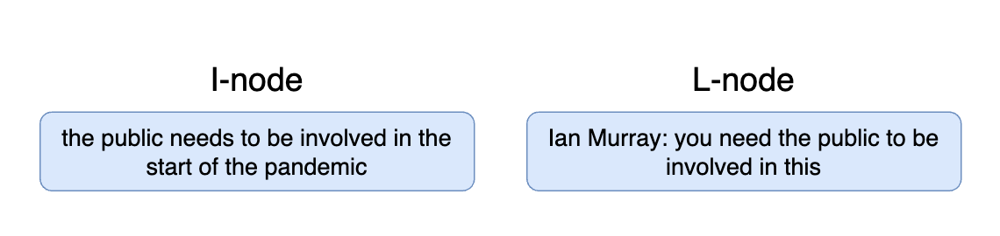
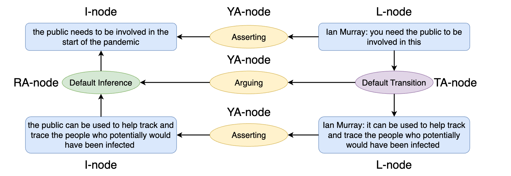

# xAIF (Extended Argumentation Interchange Format) Documentation


## Table of Contents
1. [Overview](#overview)
2. [Features of xAIF](#features-of-xaif)
3. [Structure of xAIF](#structure-of-xaif)
   - [Main Components](#main-components)
4. [Example xAIF JSON](#example-xaif-json)
   - [Blank example](#blank-example)
   - [Basic xAIF Example](#basic-xaif-example)
   - [An example from OVA](#an-example-from-ova)
   - [An example with OVA, PropositionClassifier and Skeptic](#An-example-with-OVA-PropositionClassifier-and-Skeptic)
5. [xaif library](#xaif-library)


## Overview

xAIF (Extended Argumentation Interchange Format) is an extension of the AIF (Argumentation Interchange Format).
 (see [AIF Specification](https://www.arg-tech.org/wp-content/uploads/2011/09/aif-spec.pdf)). In this section, the overview of the xAIF format is presented with its relation to the Inference Anchoring Theory (IAT). This format is aimed to standardize the way of interchanging data between tools for argument
manipulation and visualisation.  Detailed explanations IAT can be found in the following papers:
```text
Katarzyna Budzynska, Mathilde Janier, Chris Reed, and Patrick Saint Dizier. Theoretical foundations for illocutionary structure parsing. Argument & Computation, 7(1):91–108, 2016.

Mathilde Janier, Mark Snaith, Katarzyna Budzynska, John Lawrence, and Chris Reed. A sys- tem for dispute mediation: The mediation dialogue game. In The 6th International Conference on Computational Models of Argument, pages 351–358. IOS Press, 2016.
```
A text (conversation, discussion, article, etc.) in AIT is considered to be a set of separate spans that are called argumentative discourse units (ADUs).
ADUs are related between each other, creating a directed graph of the argument, which is encoded in the xAIF. 
ADUs are like atoms in this theory: the smallest units to work with.
 
xAIF is designed to handle more flexible and dynamic argument structures in environments of incremental processing. AIF imposes certain constraints, such as requiring relations to have exactly one consequent and at least one antecedent, and limiting interconnections between propositions to relations. While these constraints are valuable in a fully formed argument structure, they can be too restrictive for environments where arguments are being built piecemeal or where intermediate annotations are needed. This is where xAIF comes in. It extends the AIF to allow for both **underspecified** and **overspecified** argumentation structures, making it a more versatile tool for argumentation representation.

#### What is Argumentative Discourse Unit (ADU)

ADU is a text span which has a propositional content anchored (attached/grouped to) in either the locution (text phrase) itself or a
transition (connection) targeting this locution; and has discrete argumentative function,
in that the propositional content stands in
relation to one or more other propositions via one or more instances of inference, conflict or rephrase.

Less formally, lets look at the example:
```text

Bob: Please, be careful with the table.

Worker: Why ?  

Bob: It has a glass element, so it could brake.
```

The ADUs here are:
```python
[
 "Bob: Please, be careful with the table.",
 "Worker: Why ?",
 "Bob: It has a glass element,",
 "Bob: so it could brake."
]
```

Each of the text of ADU contains information of the speaker, as well as the information that may lead to some instance. 
For example, the sentence <i>'It has a glass elements, so it could brake.'</i> is split into 2 ADUs, as it contains 2 different spans that are connected:

<br>

'It has a glass element' -> 'so it could brake'. Note, that is not necessary a sentence, but rather a text chunk.

<br>

There are different possible relations that could be formed between ADUs. These relations are called 
<i>Discrete Argumentative Function</i>. The full list and their description can be found [here](docs_add_info%2FIAT_guidelines_and_tutorials-2023-10.pdf), Section 1.1.


#### Types of ADUs
For a content spans, ADUs are separated into two types: I-nodes (information nodes) and L-nodes (locution nodes). 
The best way to explain the difference is via the example (see image below).



The L-node has an unprocessed text ''as-is'' from the speaker, when the I-node has its processed version with the context 
and contains only required ''neutral'' semantics.
The reason for a separation like this is to make an analysis of the content easier and to minimize the effects of style, lack of context (e.g. prepositions), etc.
L-nodes and I-nodes have a one-to-one mapping between each other and represent an information of the argument with the help of a transition node. 
The example will be presented in the next section. Additionally, such separation is required in order to compare examine the style, 
the rhetoric component of the text etc. separately and with the connection to what was actually ment.


#### Transitions
A transition captures a response or a reply and embodies a functional relationship between predecessor locution and successor locution. 
Less formally, it is a directed edge between different ADUs in a graph, but with a twist: not only the edge is created, but an additional 
node in between.
The reason for this complex structure is that ADUs can have a relation not only to other ADUs, but to the connections itself. For example, 
ADU can attack the transition between two possible text spans, but not the content itself. Also, they could indicate grouping of different nodes and/or pairs of nodes
into one argument with the described structure.
Moreover, they can indicate the connection between I- and L-nodes, type of such connection and so on. Looks a bit complicated - but no worries, 
it will be easier with the image example. It comes soon! :)

<br>

Transition nodes are called <i>TA</i> nodes and may include Asserting, Questioning, Conflict and so on. Note that they do not necessary a 
binary relations: they could have multiple ancestors/children nodes.

<br>

For example, consider a TA between the L- and I-nodes in the image below.


The transition here is between L-node to I-node that indicate, that the speaker in the L-node asserted the statement that is reflected in 
the corresponding I-node.

#### Propositions and their relations
Propositions are the text chunks that consist of the contents of individual locutions. 
Proposition is always a sentence with a resolved pronouns.

<br>

Relations between propositional contents are about a speaker’s intended use of linguistic material. These relations occur 
only between the I-nodes (the ones that reflect the processed content only). 

<br>

We distinguish three types of propositional relations:
* Inference (RA nodes) (e.g. Inference, Support); 
* Conflict (CA nodes) (e.g. Attack)
* Rephrase (MA nodes) (e.g. Paraphrase)

These connections are inserted into the graph "in between" the edge. They indicate the relationships between the content 
pieces - how the argument is evolving, how people builds the argument, whether the previous I-node was attacked by another argument and so on.

#### Illocutionary Connections

The final piece of the puzzle are YA-nodes. YA-nodes are the nodes that are constructed "in between" the TA-nodes and propositional relations
(RA, CA, MA). They are used to bound (or anchor) together pairs of arguments/text chunks/content pieces in a specific relation. 
They give a clear indication on which content pieces are grouped into the same argument.

<br>

<b>Lets wrap everything we discussed so far!</b> On the image below an example of a part of a graph is presented.



Let's break it down bit by bit: 

1. The text is gathered from the speakers.
2. The text is split into L-nodes with the clear indication of the speaker and the content. 
3. I-nodes are retrieved from L-nodes: processing them by referencing the pronouns, 'neutralizing' the style, obtaining the semantics.
4. TA nodes are drawn indicating the flow of the argument (not time-manner, but connectivity of text pieces responding to other text pieces)
5. Propositional relationships are build (RA node on the example) creating the clear understanding of the specific type of the connection between the locutions.
6. YA-nodes are added to group together pairs (or maybe more) nodes into the argument.

In short, that is it! 

<br>

Now the xAIF representation of this theoretical framework will be presented.


### Features of xAIF:
1. **Underspecification**: Some constraints present in basic AIF (such as the number of antecedents or consequents in a relation) are relaxed, allowing for incomplete or evolving argumentation structures.
2. **Overspecification**: Additional structural markup can be added beyond the standard AIF, which can help represent intermediate discourse annotations that go beyond the formal structure of arguments.
3. **JSON-Based**: xAIF is represented in a convenient JSON format, making it easy to handle programmatically and compatible with a wide range of tools and platforms.
4. **Interlingua for Argument Mining**: xAIF serves as the interlingua for the open argument mining framework, facilitating both input and output for all its modules.

## Structure of xAIF
xAIF is represented as a JSON object that contains several key sections. Below is a breakdown of the structure, followed by an example of a sample xAIF representation.

The xAIF format is a json file that has the following structure:

```python
empty_xaif_example = {
    "AIF": {
        "nodes": [],
        "edges": [],
        "locutions": [],
        "participants": []
    },
    "<ADDITIONAL_FIELD>": []
}
```

THe <i>AIF</i> key contains the argument graph (as was described before). For example, let's go back to the image
that was presented:


The AIF representation of this graph would include the following:

###### nodes

Each node of the graph (I-node, L-node, RA,CA,MA,TA,YA nodes) will be presented as dictionaries of the following format:
```python
{
    "nodeID": "<NODE ID>",
    "type": "<NODE TYPE, E.G. - I>",
    "text": "<NODE TEXT>",
    "timestamp": "OPTIONAL"
}
```

The keys are:

+ <i>nodeID</i>: str, usually an integer ("1", "2" etc.). Unique identifier of the node.
+ <i>type</i>: str, the node type: "L", "I", "CA", "TA", "YA", "RA", "MA".
+ <i>text</i>: str, text related to the node. For L-nodes usually follows a pattern of "<SPEAKER NAME>:<TEXT SPAN>"; 
for I-nodes "<PROCESSED TEXT SPAN>"; for other nodes its type of relations (e.g. "Default Transition", "Default Conflict", "Asserting" and so on).
+ <i>timestamp</i>: str, optional, might not be in every node. Timestamp of the node. Depending on the data, could be different. In this case, it is a time, when the text was said without accounting on the processing time.

For example:

```python
l_node_example = {
    "nodeID": "88",
    "text": "Sergiy Zhadan: I imagine it’s scary for birds to fly over the river",
    "type": "L",
    "timestamp": "2077-01-01 12:12:30"
}

i_node_example = {
    "nodeID": "12",
    "text": "Sergiy imagines that flying over the river is scary for birds",
    "type": "I",
    "timestamp": "2077-01-01 12:12:30"
}

ra_node_example = {
    "nodeID": "1",
    "text": "Inference",
    "type": "RA"
}
```
###### edges

Each edge is presented as a json: 

```python
edge_dict_example = {
    "edgeID": "<EDGE ID STR>",
    "fromID": "<nodID from nodes>",
    "toID": "<nodID from nodes>",
}
```

The keys are:

+ <i>edgeID</i>: str, usually an integer ("1", "2" etc.). Unique identifier of the edge.
+ <i>fromID</i>: str, nodeID that corresponds to one of the nodes in AIF["nodes"], FROM which the edge is going.
+ <i>toID</i>: str, nodeID that corresponds to one of the nodes in AIF["nodes"], TO which the edge is going.

For example:

```python
edge_example = {
    "fromID": "2",
    "toID": "10",
    "edgeID": "123443"
}
```

In the example, the edge json indicates that there is an edge from the node with id "2" to the node with id "10".
The info about these nodes can be found in AIF["nodes"], in the dictionaries with the corresponding "nodeID" value.

###### participants
Participant dict contains information about the speakers. The format is as follows:

```python
participant_example ={
    "participantID": "12",
    "firstname": "Sergiy",
    "surname": "Zhadan"
}
```

The keys are:

+ <i>participantID</i>: str, unique identifier of the person.
+ <i>firstname</i>: str, first name of the person if known. Otherwise "".
+ <i>surname</i>: str, last name of the person if known. Otherwise "".

###### locutions
The locutions are metadata about the speakers (mapping of unique speaker to the node content) of the nodes. The format is as follows:

```python
locution_example = {
      "nodeID": "1265674", 
      "personID": "0", 
      "timestamp": "2023-10-11 15:34:32"
    }
```

The keys are:

+ <i>nodeID</i>: str, nodeID that corresponds to one of the nodes in AIF["nodes"].
+ <i>personID</i>: str, unique speaker identifier that is mapped to the AIF["participants"].
+ <i>timestamp</i>: str, optional, might not be in every node. Timestamp of the node. Depending on the data, could be different. In this case, it is a time, when the text was said without accounting on the processing time.

#### Additional fields of xAIF
With parsing relevant information of the argument, the parsed chunks are stored in its separate keys. By default, 
we have the following additional fields in xAIF:

```python
empty_xaif_example = {
    "AIF": {
        "nodes": [],
        "edges": [],
        "locutions": [],
        "participants": []
    },
    "actors": {"nodes": [], "participants": []},
    "assumptions": {"nodes": []}, 
    "decisive_conditions": {"nodes": []}, 
    "events": {"nodes": []}, 
    "evidences": {"nodes": []},
    "propositionTypes": {"nodes": []}, 
    "locations": {"nodes": []}, 
    "observations": {"nodes": []}, 
    "risksOpportunities": {"nodes": []}, 
    "hypotheses": {"nodes": []},
    "meansObjectives": {"nodes": []}
    
}
```

Each of them has an individual structure, depending on the requirements.

###### actors
For the actors, the xAIF["actors"] contains I-nodes and mentions of people, as well participants aggregated data. In this case, actor is a person or organization that 
appeared in the node text.
For example:

```python
xAIF["actors"] = {
    "nodes": [
        {
            "nodeID": "1",
            "mentions": [
                {
                    "start": 0,
                    "end": 10,
                    "uri": "http://person_uri"
                },
                {
                    "start": 100,
                    "end": 120,
                    "uri": "http://person_1_uri"
                }
            ]
        }
    ],
      "participants": [
          {
              "personID": "http://person_uri",
              "uri": "http://person_uri"
          },
          {
              "personID": "http://person_1_uri",
              "uri": "http://person_1_uri"
          }
      ]
}
```

The xAIF["actors"] is a dict that contains 2 keys: nodes and participants.
<p>
<i>nodes</i> value is a list of dicts of the format:

```python
{
    "nodeID": "",
    "mentions": []
}
```

'nodeID' is a string value that corresponds to the node in xAIF["AIF"]["nodes"], where the actors were detected.
Actual actors are stored in 'mentions' key. The 'mentions' value is a list of dicts of the format:

```python
{
    "start": 0,
    "end": 10,
    "uri": "http://person_uri"
}
```

'start' and 'end' are ints. They indicate start symbol and end symbol (not inclusive) of the actor in the text of the node, where the actor was found.
'uri' is a unique identifier in some database of the actor that was found.
</p>


### Example xAIF JSON

#### Blank example

```json

{
	"AIF": {
		"nodes": [],
		"edges": [],
		"schemefulfillments": [],
		"descriptorfulfillments": [],
		"participants": [],
		"locutions": []
	},
	"text": "",
  	"dialog": true,
	"OVA": {
		"firstname": "",
		"surname": "",
		"url": "",
		"nodes": [],
		"edges": []
	}
}

```

#### Basic xAIF Example
```json
{
  "AIF": {
    "descriptorfulfillments": null,
    "edges": [
      {
        "edgeID": 0,
        "fromID": 0,
        "toID": 4
      },
      {
        "edgeID": 1,
        "fromID": 4,
        "toID": 3
      },
      {
        "edgeID": 2,
        "fromID": 1,
        "toID": 6
      },
      {
        "edgeID": 3,
        "fromID": 6,
        "toID": 5
      },
      {
        "edgeID": 4,
        "fromID": 2,
        "toID": 8
      },
      {
        "edgeID": 5,
        "fromID": 8,
        "toID": 7
      },
      {
        "edgeID": 6,
        "fromID": 3,
        "toID": 9
      },
      {
        "edgeID": 7,
        "fromID": 9,
        "toID": 7
      }
    ],
    "locutions": [
      {
        "nodeID": 0,
        "personID": 0
      },
      {
        "nodeID": 1,
        "personID": 1
      },
      {
        "nodeID": 2,
        "personID": 2
      }
    ],
    "nodes": [
      {
        "nodeID": 0,
        "text": "disagreements between party members are entirely to be expected.",
        "type": "L"
      },
      {
        "nodeID": 1,
        "text": "the SNP has disagreements.",
        "type": "L"
      },
      {
        "nodeID": 2,
        "text": "it's not uncommon for there to be disagreements between party members.",
        "type": "L"
      },
      {
        "nodeID": 3,
        "text": "disagreements between party members are entirely to be expected.",
        "type": "I"
      },
      {
        "nodeID": 4,
        "text": "Default Illocuting",
        "type": "YA"
      },
      {
        "nodeID": 5,
        "text": "the SNP has disagreements.",
        "type": "I"
      },
      {
        "nodeID": 6,
        "text": "Default Illocuting",
        "type": "YA"
      },
      {
        "nodeID": 7,
        "text": "it's not uncommon for there to be disagreements between party members.",
        "type": "I"
      },
      {
        "nodeID": 8,
        "text": "Default Illocuting",
        "type": "YA"
      },
      {
        "nodeID": 9,
        "text": "Default Inference",
        "type": "RA"
      }
    ],
    "participants": [
      {
        "firstname": "Speaker",
        "participantID": 0,
        "surname": "1"
      },
      {
        "firstname": "Speaker",
        "participantID": 1,
        "surname": "2"
      }
    ],
    "schemefulfillments": null
  },
  "dialog": true,
  "ova": [],
  "text": {
    "txt": " Speaker 1 <span class=\"highlighted\" id=\"0\">disagreements between party members are entirely to be expected.</span>.<br><br> Speaker 2 <span class=\"highlighted\" id=\"1\">the SNP has disagreements.</span>.<br><br> Speaker 1 <span class=\"highlighted\" id=\"2\">it's not uncommon for there to be disagreements between party members. </span>.<br><br>"
  }
}
```

#### An example from OVA

```json
{
	"AIF": {
		"nodes": [{
			"nodeID": "2_164926129380455983",
			"text": "A",
			"type": "I"
		}, {
			"nodeID": "3_164926129380455983",
			"text": "Participant Rachel: A",
			"type": "L"
		}, {
			"nodeID": "4_164926129380455983",
			"text": "Analysing",
			"type": "YA"
		}, {
			"nodeID": "5_164926129380455983",
			"text": "Anon: Participant Rachel: A",
			"type": "L"
		}, {
			"nodeID": "6_164926129380455983",
			"text": "Asserting",
			"type": "YA"
		}, {
			"nodeID": "15_164926162804546033",
			"text": "B",
			"type": "I"
		}, {
			"nodeID": "16_164926162804546033",
			"text": "Participant Rachel: B",
			"type": "L"
		}, {
			"nodeID": "17_164926162804546033",
			"text": "Analysing",
			"type": "YA"
		}, {
			"nodeID": "18_164926162804546033",
			"text": "Anon: Participant Rachel: B",
			"type": "L"
		}, {
			"nodeID": "19_164926162804546033",
			"text": "Asserting",
			"type": "YA"
		}, {
			"nodeID": "20_164926162804546033",
			"text": "Default Transition",
			"type": "TA"
		}, {
			"nodeID": "21_164926162804546033",
			"text": "Default Inference",
			"type": "RA"
		}, {
			"nodeID": "22_164926162804546033",
			"text": "Arguing",
			"type": "YA"
		}],
		"edges": [{
			"edgeID": 1,
			"fromID": "4_164926129380455983",
			"toID": "3_164926129380455983"
		}, {
			"edgeID": 2,
			"fromID": "5_164926129380455983",
			"toID": "4_164926129380455983"
		}, {
			"edgeID": 3,
			"fromID": "3_164926129380455983",
			"toID": "6_164926129380455983"
		}, {
			"edgeID": 4,
			"fromID": "6_164926129380455983",
			"toID": "2_164926129380455983"
		}, {
			"edgeID": 5,
			"fromID": "17_164926162804546033",
			"toID": "16_164926162804546033"
		}, {
			"edgeID": 6,
			"fromID": "18_164926162804546033",
			"toID": "17_164926162804546033"
		}, {
			"edgeID": 7,
			"fromID": "16_164926162804546033",
			"toID": "19_164926162804546033"
		}, {
			"edgeID": 8,
			"fromID": "19_164926162804546033",
			"toID": "15_164926162804546033"
		}, {
			"edgeID": 9,
			"fromID": "3_164926129380455983",
			"toID": "20_164926162804546033"
		}, {
			"edgeID": 10,
			"fromID": "20_164926162804546033",
			"toID": "16_164926162804546033"
		}, {
			"edgeID": 11,
			"fromID": "15_164926162804546033",
			"toID": "21_164926162804546033"
		}, {
			"edgeID": 12,
			"fromID": "21_164926162804546033",
			"toID": "2_164926129380455983"
		}, {
			"edgeID": 13,
			"fromID": "20_164926162804546033",
			"toID": "22_164926162804546033"
		}, {
			"edgeID": 14,
			"fromID": "22_164926162804546033",
			"toID": "21_164926162804546033"
		}],
		"schemefulfillments": [{
			"nodeID": "4_164926129380455983",
			"schemeID": "75"
		}, {
			"nodeID": "6_164926129380455983",
			"schemeID": "74"
		}, {
			"nodeID": "17_164926162804546033",
			"schemeID": "75"
		}, {
			"nodeID": "19_164926162804546033",
			"schemeID": "74"
		}, {
			"nodeID": "20_164926162804546033",
			"schemeID": "82"
		}, {
			"nodeID": "21_164926162804546033",
			"schemeID": "72"
		}, {
			"nodeID": "22_164926162804546033",
			"schemeID": "80"
		}],
		"descriptorfulfillments": [],
		"participants": [{
			"participantID": 1,
			"firstname": "Participant",
			"surname": "Rachel"
		}, {
			"participantID": 2,
			"firstname": "Participant",
			"surname": "Carolyn"
		}, {
			"participantID": 3,
			"firstname": "Participant",
			"surname": "Mo"
		}, {
			"participantID": 4,
			"firstname": "Participant",
			"surname": "Zoe"
		}, {
			"participantID": 5,
			"firstname": "Participant",
			"surname": "Claire"
		}, {
			"participantID": 6,
			"firstname": "Participant",
			"surname": "Lee"
		}, {
			"participantID": 7,
			"firstname": "Participant",
			"surname": "Sally"
		}, {
			"participantID": 8,
			"firstname": "Participant",
			"surname": "Kalbir"
		}, {
			"participantID": 9,
			"firstname": "Participant",
			"surname": "Alice"
		}, {
			"participantID": 10,
			"firstname": "Anne",
			"surname": "Robinson"
		}, {
			"participantID": 11,
			"firstname": "Diane",
			"surname": "Munday"
		}, {
			"participantID": 12,
			"firstname": "Neena",
			"surname": "Modi"
		}, {
			"participantID": 13,
			"firstname": "David",
			"surname": "Steel"
		}, {
			"participantID": 14,
			"firstname": "Neil",
			"surname": "Lyndon"
		}],
		"locutions": [{
			"nodeID": "3_164926129380455983",
			"personID": 1,
			"start": "2021-11-11 21:50:00",
			"end": null
		}, {
			"nodeID": "16_164926162804546033",
			"personID": "1",
			"start": "2021-11-11 21:50:01",
			"end": null
		}]
	},
	"text": "<span id=\"node3_164926129380455983\" class=\"highlighted\">A</span> because <span id=\"node16_164926162804546033\" class=\"highlighted\">B</span><br>",
	"OVA": {
		"firstname": "Anon",
		"surname": "User",
		"url": "",
		"nodes": [{
			"nodeID": "2_164926129380455983",
			"visible": true,
			"x": 273,
			"y": 140,
			"timestamp": ""
		}, {
			"nodeID": "3_164926129380455983",
			"visible": true,
			"x": 723,
			"y": 140,
			"timestamp": "Thu Nov 11 2021 21:50:00 GMT+0000 (Greenwich Mean Time)"
		}, {
			"nodeID": "4_164926129380455983",
			"visible": false,
			"x": 0,
			"y": 0,
			"timestamp": ""
		}, {
			"nodeID": "5_164926129380455983",
			"visible": false,
			"x": 0,
			"y": 0,
			"timestamp": ""
		}, {
			"nodeID": "6_164926129380455983",
			"visible": true,
			"x": 498,
			"y": 140,
			"timestamp": ""
		}, {
			"nodeID": "15_164926162804546033",
			"visible": true,
			"x": "257",
			"y": "275",
			"timestamp": ""
		}, {
			"nodeID": "16_164926162804546033",
			"visible": true,
			"x": "714",
			"y": "280",
			"timestamp": "Thu Nov 11 2021 21:50:01 GMT+0000 (Greenwich Mean Time)"
		}, {
			"nodeID": "17_164926162804546033",
			"visible": false,
			"x": 0,
			"y": 0,
			"timestamp": ""
		}, {
			"nodeID": "18_164926162804546033",
			"visible": false,
			"x": 0,
			"y": 0,
			"timestamp": ""
		}, {
			"nodeID": "19_164926162804546033",
			"visible": true,
			"x": "464",
			"y": "271",
			"timestamp": ""
		}, {
			"nodeID": "20_164926162804546033",
			"visible": true,
			"x": 717.5,
			"y": 220,
			"timestamp": ""
		}, {
			"nodeID": "21_164926162804546033",
			"visible": true,
			"x": 274.5,
			"y": 218.5,
			"timestamp": ""
		}, {
			"nodeID": "22_164926162804546033",
			"visible": true,
			"x": "464",
			"y": "213",
			"timestamp": ""
		}],
		"edges": [{
			"fromID": "4_164926129380455983",
			"toID": "3_164926129380455983",
			"visible": false
		}, {
			"fromID": "5_164926129380455983",
			"toID": "4_164926129380455983",
			"visible": false
		}, {
			"fromID": "3_164926129380455983",
			"toID": "6_164926129380455983",
			"visible": true
		}, {
			"fromID": "6_164926129380455983",
			"toID": "2_164926129380455983",
			"visible": true
		}, {
			"fromID": "17_164926162804546033",
			"toID": "16_164926162804546033",
			"visible": false
		}, {
			"fromID": "18_164926162804546033",
			"toID": "17_164926162804546033",
			"visible": false
		}, {
			"fromID": "16_164926162804546033",
			"toID": "19_164926162804546033",
			"visible": true
		}, {
			"fromID": "19_164926162804546033",
			"toID": "15_164926162804546033",
			"visible": true
		}, {
			"fromID": "3_164926129380455983",
			"toID": "20_164926162804546033",
			"visible": true
		}, {
			"fromID": "20_164926162804546033",
			"toID": "16_164926162804546033",
			"visible": true
		}, {
			"fromID": "15_164926162804546033",
			"toID": "21_164926162804546033",
			"visible": true
		}, {
			"fromID": "21_164926162804546033",
			"toID": "2_164926129380455983",
			"visible": true
		}, {
			"fromID": "20_164926162804546033",
			"toID": "22_164926162804546033",
			"visible": true
		}, {
			"fromID": "22_164926162804546033",
			"toID": "21_164926162804546033",
			"visible": true
		}]
	}
}

```


### An example with OVA, PropositionClassifier and Skeptic


```json

{
  "AIF": {
    "nodes": [
      {
        "nodeID": "2_166178046893607143",
        "text": "Dungeons and Dragons and its imitators are right out of the pit of hell",
        "type": "I"
      },
      {
        "nodeID": "3_166178046893607143",
        "text": "No Christian or sane, decent individual of whatever faith really should have anything to do with Dungeons and Dragons and its imitators",
        "type": "I"
      },
      {
        "nodeID": "5_166178046893607143",
        "text": "Consequences",
        "type": "RA"
      },
      {
        "nodeID": "6_166178046893607143",
        "text": "It's just a game!",
        "type": "I"
      },
      {
        "nodeID": "7_166178046893607143",
        "text": "the person who thinks they can mess with Dungeons and Dragons without getting burnt is whistling in the dark",
        "type": "I"
      },
      {
        "nodeID": "8_166178046893607143",
        "text": "people who think they can play around with crack or pre-marital sex and not get burned by death, AIDS or pregnancy are whistling in the dark",
        "type": "I"
      },
      {
        "nodeID": "10_166178046893607143",
        "text": "Analogy",
        "type": "RA"
      },
      {
        "nodeID": "12_166178046893607143",
        "text": "Default Conflict",
        "type": "CA"
      },
      {
        "nodeID": "13_166178046893607143",
        "text": "Dungeons and Dragons is essentially a feeding program for occultism and witchcraft",
        "type": "I"
      },
      {
        "nodeID": "15_166178046893607143",
        "text": "Verbal Classification",
        "type": "RA"
      },
      {
        "nodeID": "16_166178046893607143",
        "text": "Dungeons and Dragons violates the commandment of I Ths. 5:22 \"Abstain from all appearance of evil.\"",
        "type": "I"
      },
      {
        "nodeID": "18_166178046893607143",
        "text": "Sign",
        "type": "RA"
      },
      {
        "nodeID": "19_166178046893607143",
        "text": "Much of the art, figurines, and writing within Dungeons and Dragons certainly appears evil to say the least of it",
        "type": "I"
      },
      {
        "nodeID": "21_166178046893607143",
        "text": "Sign",
        "type": "RA"
      },
      {
        "nodeID": "22_166178046893607143",
        "text": "the materials themselves contain magical rituals",
        "type": "I"
      },
      {
        "nodeID": "24_166178046893607143",
        "text": "Sign",
        "type": "RA"
      },
      {
        "nodeID": "25_166178046893607143",
        "text": "for the most part, the rituals are certainly authentic",
        "type": "I"
      },
      {
        "nodeID": "27_166178046893607143",
        "text": "Expert Opinion",
        "type": "RA"
      },
      {
        "nodeID": "29_166178046893607143",
        "text": "Default Conflict",
        "type": "CA"
      },
      {
        "nodeID": "31_166178046893607143",
        "text": "Default Conflict",
        "type": "CA"
      },
      {
        "nodeID": "33_166178046893607143",
        "text": "Default Conflict",
        "type": "CA"
      },
      {
        "nodeID": "34_166178046893607143",
        "text": "If a person \"innocently\" works an authentic ritual that conjures up a demon, or curses someone, thinking that they are only playing a game, the ritual will still have efficacy",
        "type": "I"
      },
      {
        "nodeID": "36_166178046893607143",
        "text": "Correlation To Cause",
        "type": "RA"
      },
      {
        "nodeID": "37_166178046893607143",
        "text": "If you play at shooting your friend in the head with what you think is an unloaded pistol and don't know a shell is in the chamber, your friend is not any less dead because you were playing",
        "type": "I"
      },
      {
        "nodeID": "39_166178046893607143",
        "text": "Analogy",
        "type": "RA"
      }
    ],
    "edges": [
      {
        "edgeID": 1,
        "fromID": "2_166178046893607143",
        "toID": "5_166178046893607143"
      },
      {
        "edgeID": 2,
        "fromID": "5_166178046893607143",
        "toID": "3_166178046893607143"
      },
      {
        "edgeID": 3,
        "fromID": "8_166178046893607143",
        "toID": "10_166178046893607143"
      },
      {
        "edgeID": 4,
        "fromID": "10_166178046893607143",
        "toID": "7_166178046893607143"
      },
      {
        "edgeID": 5,
        "fromID": "7_166178046893607143",
        "toID": "12_166178046893607143"
      },
      {
        "edgeID": 6,
        "fromID": "12_166178046893607143",
        "toID": "6_166178046893607143"
      },
      {
        "edgeID": 7,
        "fromID": "13_166178046893607143",
        "toID": "15_166178046893607143"
      },
      {
        "edgeID": 8,
        "fromID": "15_166178046893607143",
        "toID": "2_166178046893607143"
      },
      {
        "edgeID": 9,
        "fromID": "16_166178046893607143",
        "toID": "18_166178046893607143"
      },
      {
        "edgeID": 10,
        "fromID": "18_166178046893607143",
        "toID": "13_166178046893607143"
      },
      {
        "edgeID": 11,
        "fromID": "19_166178046893607143",
        "toID": "21_166178046893607143"
      },
      {
        "edgeID": 12,
        "fromID": "21_166178046893607143",
        "toID": "16_166178046893607143"
      },
      {
        "edgeID": 13,
        "fromID": "22_166178046893607143",
        "toID": "24_166178046893607143"
      },
      {
        "edgeID": 14,
        "fromID": "24_166178046893607143",
        "toID": "13_166178046893607143"
      },
      {
        "edgeID": 15,
        "fromID": "25_166178046893607143",
        "toID": "27_166178046893607143"
      },
      {
        "edgeID": 16,
        "fromID": "27_166178046893607143",
        "toID": "22_166178046893607143"
      },
      {
        "edgeID": 17,
        "fromID": "6_166178046893607143",
        "toID": "29_166178046893607143"
      },
      {
        "edgeID": 18,
        "fromID": "29_166178046893607143",
        "toID": "3_166178046893607143"
      },
      {
        "edgeID": 19,
        "fromID": "6_166178046893607143",
        "toID": "31_166178046893607143"
      },
      {
        "edgeID": 20,
        "fromID": "31_166178046893607143",
        "toID": "2_166178046893607143"
      },
      {
        "edgeID": 21,
        "fromID": "6_166178046893607143",
        "toID": "33_166178046893607143"
      },
      {
        "edgeID": 22,
        "fromID": "33_166178046893607143",
        "toID": "13_166178046893607143"
      },
      {
        "edgeID": 23,
        "fromID": "34_166178046893607143",
        "toID": "36_166178046893607143"
      },
      {
        "edgeID": 24,
        "fromID": "36_166178046893607143",
        "toID": "25_166178046893607143"
      },
      {
        "edgeID": 25,
        "fromID": "37_166178046893607143",
        "toID": "39_166178046893607143"
      },
      {
        "edgeID": 26,
        "fromID": "39_166178046893607143",
        "toID": "34_166178046893607143"
      }
    ],
    "schemefulfillments": [
      {
        "nodeID": "2_166178046893607143",
        "schemeID": "0"
      },
      {
        "nodeID": "3_166178046893607143",
        "schemeID": "0"
      },
      {
        "nodeID": "5_166178046893607143",
        "schemeID": "237"
      },
      {
        "nodeID": "6_166178046893607143",
        "schemeID": "0"
      },
      {
        "nodeID": "7_166178046893607143",
        "schemeID": "0"
      },
      {
        "nodeID": "8_166178046893607143",
        "schemeID": "0"
      },
      {
        "nodeID": "10_166178046893607143",
        "schemeID": "1"
      },
      {
        "nodeID": "12_166178046893607143",
        "schemeID": "71"
      },
      {
        "nodeID": "13_166178046893607143",
        "schemeID": "0"
      },
      {
        "nodeID": "15_166178046893607143",
        "schemeID": "31"
      },
      {
        "nodeID": "16_166178046893607143",
        "schemeID": "0"
      },
      {
        "nodeID": "18_166178046893607143",
        "schemeID": "30"
      },
      {
        "nodeID": "19_166178046893607143",
        "schemeID": "0"
      },
      {
        "nodeID": "21_166178046893607143",
        "schemeID": "30"
      },
      {
        "nodeID": "22_166178046893607143",
        "schemeID": "0"
      },
      {
        "nodeID": "24_166178046893607143",
        "schemeID": "30"
      },
      {
        "nodeID": "25_166178046893607143",
        "schemeID": "0"
      },
      {
        "nodeID": "27_166178046893607143",
        "schemeID": "15"
      },
      {
        "nodeID": "29_166178046893607143",
        "schemeID": "71"
      },
      {
        "nodeID": "31_166178046893607143",
        "schemeID": "71"
      },
      {
        "nodeID": "33_166178046893607143",
        "schemeID": "71"
      },
      {
        "nodeID": "34_166178046893607143",
        "schemeID": "0"
      },
      {
        "nodeID": "36_166178046893607143",
        "schemeID": "7"
      },
      {
        "nodeID": "37_166178046893607143",
        "schemeID": "0"
      },
      {
        "nodeID": "39_166178046893607143",
        "schemeID": "1"
      }
    ],
    "participants": [
      {
        "participantID": 1,
        "firstname": "Participant",
        "surname": "Rachel"
      },
      {
        "participantID": 2,
        "firstname": "Participant",
        "surname": "Carolyn"
      },
      {
        "participantID": 3,
        "firstname": "Participant",
        "surname": "Mo"
      },
      {
        "participantID": 4,
        "firstname": "Participant",
        "surname": "Zoe"
      },
      {
        "participantID": 5,
        "firstname": "Participant",
        "surname": "Claire"
      },
      {
        "participantID": 6,
        "firstname": "Participant",
        "surname": "Lee"
      },
      {
        "participantID": 7,
        "firstname": "Participant",
        "surname": "Sally"
      },
      {
        "participantID": 8,
        "firstname": "Participant",
        "surname": "Kalbir"
      },
      {
        "participantID": 9,
        "firstname": "Participant",
        "surname": "Alice"
      },
      {
        "participantID": 10,
        "firstname": "Anne",
        "surname": "Robinson"
      },
      {
        "participantID": 11,
        "firstname": "Diane",
        "surname": "Munday"
      },
      {
        "participantID": 12,
        "firstname": "Neena",
        "surname": "Modi"
      },
      {
        "participantID": 13,
        "firstname": "David",
        "surname": "Steel"
      },
      {
        "participantID": 14,
        "firstname": "Neil",
        "surname": "Lyndon"
      }
    ],
    "locutions": [],
    "descriptorfulfillments": [],
    "cqdescriptorfulfillments": []
  },
  "text": "Dungeons and Dragons is essentially a feeding program for occultism and witchcraft. For Christians, the first scriptural problem is the fact that Dungeons and Dragons violates the commandment of I Ths. 5:22 \"Abstain from all appearance of evil.\" Much of the art, figurines, and writing within Dungeons and Dragons certainly appears evil to say the least of it.

On top of that, the second issue is that the materials themselves contain magical rituals. From my own experience as a witch high priest (Alexandrian tradition) during the period 1973-84, I can tell you that, for the most part, the rituals are certainly authentic.

If a person \"innocently\" works an authentic ritual that conjures up a demon, or curses someone, thinking that they are only playing a game, the ritual will still have efficacy. If you play at shooting your friend in the head with what you think is an unloaded pistol and don't know a shell is in the chamber, is your friend any less dead because you were playing? 

Of course, some people will say: \"It's just a game!\" But like the people who think they can play around with crack or pre-marital sex and not get burned by death, AIDS or pregnancy, the person who thinks they can mess with Dungeons and Dragons without getting burnt is whistling in the dark.

Thus, in my mind, there is no doubt that Dungeons and Dragons and its imitators are right out of the pit of hell. No Christian or sane, decent individual of whatever faith really should have anything to do with them.
",
  "OVA": {
    "firstname": "Jacky",
    "surname": "Visser",
    "url": "",
    "nodes": [
      {
        "nodeID": "2_166178046893607143",
        "visible": true,
        "x": 192,
        "y": 175,
        "timestamp": ""
      },
      {
        "nodeID": "3_166178046893607143",
        "visible": true,
        "x": 190,
        "y": 7,
        "timestamp": ""
      },
      {
        "nodeID": "5_166178046893607143",
        "visible": true,
        "x": 235,
        "y": 132,
        "timestamp": ""
      },
      {
        "nodeID": "6_166178046893607143",
        "visible": true,
        "x": 614,
        "y": 200,
        "timestamp": ""
      },
      {
        "nodeID": "7_166178046893607143",
        "visible": true,
        "x": 581,
        "y": 311,
        "timestamp": ""
      },
      {
        "nodeID": "8_166178046893607143",
        "visible": true,
        "x": 582,
        "y": 479,
        "timestamp": ""
      },
      {
        "nodeID": "10_166178046893607143",
        "visible": true,
        "x": 638,
        "y": 422,
        "timestamp": ""
      },
      {
        "nodeID": "12_166178046893607143",
        "visible": true,
        "x": 617,
        "y": 257,
        "timestamp": ""
      },
      {
        "nodeID": "13_166178046893607143",
        "visible": true,
        "x": 192,
        "y": 311,
        "timestamp": ""
      },
      {
        "nodeID": "15_166178046893607143",
        "visible": true,
        "x": 234,
        "y": 264,
        "timestamp": ""
      },
      {
        "nodeID": "16_166178046893607143",
        "visible": true,
        "x": 84,
        "y": 465,
        "timestamp": ""
      },
      {
        "nodeID": "18_166178046893607143",
        "visible": true,
        "x": 210,
        "y": 404,
        "timestamp": ""
      },
      {
        "nodeID": "19_166178046893607143",
        "visible": true,
        "x": 84,
        "y": 616,
        "timestamp": ""
      },
      {
        "nodeID": "21_166178046893607143",
        "visible": true,
        "x": 161,
        "y": 569,
        "timestamp": ""
      },
      {
        "nodeID": "22_166178046893607143",
        "visible": true,
        "x": 321,
        "y": 464,
        "timestamp": ""
      },
      {
        "nodeID": "24_166178046893607143",
        "visible": true,
        "x": 332,
        "y": 402,
        "timestamp": ""
      },
      {
        "nodeID": "25_166178046893607143",
        "visible": true,
        "x": 325,
        "y": 579,
        "timestamp": ""
      },
      {
        "nodeID": "27_166178046893607143",
        "visible": true,
        "x": 367,
        "y": 532,
        "timestamp": ""
      },
      {
        "nodeID": "29_166178046893607143",
        "visible": true,
        "x": 425,
        "y": 52,
        "timestamp": ""
      },
      {
        "nodeID": "31_166178046893607143",
        "visible": true,
        "x": 423,
        "y": 195,
        "timestamp": ""
      },
      {
        "nodeID": "33_166178046893607143",
        "visible": true,
        "x": 421,
        "y": 321,
        "timestamp": ""
      },
      {
        "nodeID": "34_166178046893607143",
        "visible": true,
        "x": 327,
        "y": 694,
        "timestamp": ""
      },
      {
        "nodeID": "36_166178046893607143",
        "visible": true,
        "x": 363,
        "y": 647,
        "timestamp": ""
      },
      {
        "nodeID": "37_166178046893607143",
        "visible": true,
        "x": 327,
        "y": 866,
        "timestamp": ""
      },
      {
        "nodeID": "39_166178046893607143",
        "visible": true,
        "x": 392,
        "y": 820,
        "timestamp": ""
      }
    ],
    "edges": [
      {
        "fromID": "2_166178046893607143",
        "toID": "5_166178046893607143",
        "visible": true
      },
      {
        "fromID": "5_166178046893607143",
        "toID": "3_166178046893607143",
        "visible": true
      },
      {
        "fromID": "8_166178046893607143",
        "toID": "10_166178046893607143",
        "visible": true
      },
      {
        "fromID": "10_166178046893607143",
        "toID": "7_166178046893607143",
        "visible": true
      },
      {
        "fromID": "7_166178046893607143",
        "toID": "12_166178046893607143",
        "visible": true
      },
      {
        "fromID": "12_166178046893607143",
        "toID": "6_166178046893607143",
        "visible": true
      },
      {
        "fromID": "13_166178046893607143",
        "toID": "15_166178046893607143",
        "visible": true
      },
      {
        "fromID": "15_166178046893607143",
        "toID": "2_166178046893607143",
        "visible": true
      },
      {
        "fromID": "16_166178046893607143",
        "toID": "18_166178046893607143",
        "visible": true
      },
      {
        "fromID": "18_166178046893607143",
        "toID": "13_166178046893607143",
        "visible": true
      },
      {
        "fromID": "19_166178046893607143",
        "toID": "21_166178046893607143",
        "visible": true
      },
      {
        "fromID": "21_166178046893607143",
        "toID": "16_166178046893607143",
        "visible": true
      },
      {
        "fromID": "22_166178046893607143",
        "toID": "24_166178046893607143",
        "visible": true
      },
      {
        "fromID": "24_166178046893607143",
        "toID": "13_166178046893607143",
        "visible": true
      },
      {
        "fromID": "25_166178046893607143",
        "toID": "27_166178046893607143",
        "visible": true
      },
      {
        "fromID": "27_166178046893607143",
        "toID": "22_166178046893607143",
        "visible": true
      },
      {
        "fromID": "6_166178046893607143",
        "toID": "29_166178046893607143",
        "visible": true
      },
      {
        "fromID": "29_166178046893607143",
        "toID": "3_166178046893607143",
        "visible": true
      },
      {
        "fromID": "6_166178046893607143",
        "toID": "31_166178046893607143",
        "visible": true
      },
      {
        "fromID": "31_166178046893607143",
        "toID": "2_166178046893607143",
        "visible": true
      },
      {
        "fromID": "6_166178046893607143",
        "toID": "33_166178046893607143",
        "visible": true
      },
      {
        "fromID": "33_166178046893607143",
        "toID": "13_166178046893607143",
        "visible": true
      },
      {
        "fromID": "34_166178046893607143",
        "toID": "36_166178046893607143",
        "visible": true
      },
      {
        "fromID": "36_166178046893607143",
        "toID": "25_166178046893607143",
        "visible": true
      },
      {
        "fromID": "37_166178046893607143",
        "toID": "39_166178046893607143",
        "visible": true
      },
      {
        "fromID": "39_166178046893607143",
        "toID": "34_166178046893607143",
        "visible": true
      }
    ]
  },
  "propositionClassifier": {
    "nodes": [
      {
        "nodeID": "2_166178046893607143",
        "propType": "value"
      },
      {
        "nodeID": "3_166178046893607143",
        "propType": "policy"
      },
      {
        "nodeID": "6_166178046893607143",
        "propType": "fact"
      },
      {
        "nodeID": "7_166178046893607143",
        "propType": "value"
      },
      {
        "nodeID": "8_166178046893607143",
        "propType": "value"
      },
      {
        "nodeID": "13_166178046893607143",
        "propType": "fact"
      },
      {
        "nodeID": "16_166178046893607143",
        "propType": "value"
      },
      {
        "nodeID": "19_166178046893607143",
        "propType": "value"
      },
      {
        "nodeID": "22_166178046893607143",
        "propType": "fact"
      },
      {
        "nodeID": "25_166178046893607143",
        "propType": "fact"
      },
      {
        "nodeID": "34_166178046893607143",
        "propType": "fact"
      },
      {
        "nodeID": "37_166178046893607143",
        "propType": "fact"
      }
    ]
  },
  "Skeptic": {
    "questions": [
      {
        "rank": 1,
        "nodeID": "3_166178046893607143",
        "question": "Is this statement consistent with previous proposals?"
      },
      {
        "rank": 2,
        "nodeID": "3_166178046893607143",
        "question": "Is this policy appropriate for this objective?"
      },
      {
        "rank": 3,
        "nodeID": "5_166178046893607143",
        "question": "How strong is the probability or plausibility that these cited consequences will (may, might, must) occur?"
      },
      {
        "rank": 4,
        "nodeID": "5_166178046893607143",
        "question": "What evidence, if any, supported the claim that these consequences will (may, might, must) occur if the action is brought about?"
      },
      {
        "rank": 5,
        "nodeID": "5_166178046893607143",
        "question": "Are there consequences of the opposite value that ought to be taken into account?"
      },
      {
        "rank": 6,
        "nodeID": "2_166178046893607143",
        "question": "Does this statement reflect a popularly held value?"
      },
      {
        "rank": 7,
        "nodeID": "15_166178046893607143",
        "question": "What evidence is there that this thing definitely has the property, as opposed to evidence indicating room for doubt on whether it should be so classified?"
      },
      {
        "rank": 8,
        "nodeID": "15_166178046893607143",
        "question": "Is the verbal classification in the classification premise based merely on a stipulative or biased definition that is subject to doubt?"
      },
      {
        "rank": 9,
        "nodeID": "13_166178046893607143",
        "question": "Is this statement actually true?"
      },
      {
        "rank": 10,
        "nodeID": "18_166178046893607143",
        "question": "What is the strength of the correlation of the sign with the event signified?"
      },
      {
        "rank": 11,
        "nodeID": "18_166178046893607143",
        "question": "Are there other events that would more reliably account for the sign?"
      },
      {
        "rank": 12,
        "nodeID": "24_166178046893607143",
        "question": "What is the strength of the correlation of the sign with the event signified?"
      },
      {
        "rank": 13,
        "nodeID": "24_166178046893607143",
        "question": "Are there other events that would more reliably account for the sign?"
      },
      {
        "rank": 14,
        "nodeID": "22_166178046893607143",
        "question": "Is this statement actually true?"
      },
      {
        "rank": 15,
        "nodeID": "27_166178046893607143",
        "question": "How credible is the source as an expert?"
      },
      {
        "rank": 16,
        "nodeID": "27_166178046893607143",
        "question": "Is the source an expert in a relevant field?"
      },
      {
        "rank": 17,
        "nodeID": "27_166178046893607143",
        "question": "What did the source assert that implies this claim?"
      },
      {
        "rank": 18,
        "nodeID": "27_166178046893607143",
        "question": "Is the source personally reliable?"
      },
      {
        "rank": 19,
        "nodeID": "27_166178046893607143",
        "question": "Is the claim consistent with what other experts assert?"
      },
      {
        "rank": 20,
        "nodeID": "27_166178046893607143",
        "question": "Is the source’s assertion based on evidence?"
      },
      {
        "rank": 21,
        "nodeID": "6_166178046893607143",
        "question": "Is this statement actually true?"
      },
      {
        "rank": 22,
        "nodeID": "6_166178046893607143",
        "question": "Could there be any reasons for accepting this proposition?"
      },
      {
        "rank": 23,
        "nodeID": "6_166178046893607143",
        "question": "Is there any argument in support of this claim?"
      },
      {
        "rank": 24,
        "nodeID": "25_166178046893607143",
        "question": "Is this statement actually true?"
      },
      {
        "rank": 25,
        "nodeID": "36_166178046893607143",
        "question": "Is there really a correlation between the two states of affairs?"
      },
      {
        "rank": 26,
        "nodeID": "36_166178046893607143",
        "question": "Is there any reason to think that the correlation is any more than a coincidence?"
      },
      {
        "rank": 27,
        "nodeID": "36_166178046893607143",
        "question": "Could there be some third factor that is causing both states of affairs?"
      },
      {
        "rank": 28,
        "nodeID": "7_166178046893607143",
        "question": "Does this statement reflect a popularly held value?"
      },
      {
        "rank": 29,
        "nodeID": "10_166178046893607143",
        "question": "Are there differences between the compared cases that would tend to undermine the force of the similarity cited?"
      },
      {
        "rank": 30,
        "nodeID": "10_166178046893607143",
        "question": "Is the property true or false in the first compared case?"
      },
      {
        "rank": 31,
        "nodeID": "10_166178046893607143",
        "question": "Is there some other comparable case that is also similar to the first case, but in which the property is not true (false)?"
      },
      {
        "rank": 32,
        "nodeID": "16_166178046893607143",
        "question": "Does this statement reflect a popularly held value?"
      },
      {
        "rank": 33,
        "nodeID": "21_166178046893607143",
        "question": "What is the strength of the correlation of the sign with the event signified?"
      },
      {
        "rank": 34,
        "nodeID": "21_166178046893607143",
        "question": "Are there other events that would more reliably account for the sign?"
      },
      {
        "rank": 35,
        "nodeID": "34_166178046893607143",
        "question": "Is this statement actually true?"
      },
      {
        "rank": 36,
        "nodeID": "39_166178046893607143",
        "question": "Are there differences between the compared cases that would tend to undermine the force of the similarity cited?"
      },
      {
        "rank": 37,
        "nodeID": "39_166178046893607143",
        "question": "Is the property true or false in the first compared case?"
      },
      {
        "rank": 38,
        "nodeID": "39_166178046893607143",
        "question": "Is there some other comparable case that is also similar to the first case, but in which the property is not true (false)?"
      },
      {
        "rank": 39,
        "nodeID": "8_166178046893607143",
        "question": "Does this statement reflect a popularly held value?"
      },
      {
        "rank": 40,
        "nodeID": "19_166178046893607143",
        "question": "Does this statement reflect a popularly held value?"
      },
      {
        "rank": 41,
        "nodeID": "37_166178046893607143",
        "question": "Is this statement actually true?"
      }
    ]
  }
}

```

## xaif library

`xaif` is a Python library for working with Argument Interchange Format (AIF), primarily designed to facilitate the development, manipulation, and evaluation of argumentat structures. This package provides essential utilities to validate, traverse, and manipulate AIF-compliant JSON structures, enabling users to effectively work with complex argumentation data.

## Features

- Manage argument components: Add and manipulate various components of an argumentation framework, including relations, nodes, and edges.
- Export data in CSV format: Generate tabular representations of argument components with their respective relation types.


## Installation

You can install the `xaif` package via pip:

```sh
pip install xaif
```

## Usage

### Importing the Library

```python
from xaif import AIF
```

### Example

```python
from xaif import AIF

# Sample xAIF JSON 
xaif_data= {
  "AIF": {
    "descriptorfulfillments": null,
    "edges": [
      {
        "edgeID": 0,
        "fromID": 0,
        "toID": 4
      },
      {
        "edgeID": 1,
        "fromID": 4,
        "toID": 3
      },
      {
        "edgeID": 2,
        "fromID": 1,
        "toID": 6
      },
      {
        "edgeID": 3,
        "fromID": 6,
        "toID": 5
      },
      {
        "edgeID": 4,
        "fromID": 2,
        "toID": 8
      },
      {
        "edgeID": 5,
        "fromID": 8,
        "toID": 7
      },
      {
        "edgeID": 6,
        "fromID": 3,
        "toID": 9
      },
      {
        "edgeID": 7,
        "fromID": 9,
        "toID": 7
      }
    ],
    "locutions": [
      {
        "nodeID": 0,
        "personID": 0
      },
      {
        "nodeID": 1,
        "personID": 1
      },
      {
        "nodeID": 2,
        "personID": 2
      }
    ],
    "nodes": [
      {
        "nodeID": 0,
        "text": "disagreements between party members are entirely to be expected.",
        "type": "L"
      },
      {
        "nodeID": 1,
        "text": "the SNP has disagreements.",
        "type": "L"
      },
      {
        "nodeID": 2,
        "text": "it's not uncommon for there to be disagreements between party members.",
        "type": "L"
      },
      {
        "nodeID": 3,
        "text": "disagreements between party members are entirely to be expected.",
        "type": "I"
      },
      {
        "nodeID": 4,
        "text": "Default Illocuting",
        "type": "YA"
      },
      {
        "nodeID": 5,
        "text": "the SNP has disagreements.",
        "type": "I"
      },
      {
        "nodeID": 6,
        "text": "Default Illocuting",
        "type": "YA"
      },
      {
        "nodeID": 7,
        "text": "it's not uncommon for there to be disagreements between party members.",
        "type": "I"
      },
      {
        "nodeID": 8,
        "text": "Default Illocuting",
        "type": "YA"
      },
      {
        "nodeID": 9,
        "text": "Default Inference",
        "type": "RA"
      }
    ],
    "participants": [
      {
        "firstname": "Speaker",
        "participantID": 0,
        "surname": "1"
      },
      {
        "firstname": "Speaker",
        "participantID": 1,
        "surname": "2"
      }
    ],
    "schemefulfillments": null
  },
  "dialog": true,
  "ova": [],
  "text": {
    "txt": " Speaker 1 <span class=\"highlighted\" id=\"0\">disagreements between party members are entirely to be expected.</span>.<br><br> Speaker 2 <span class=\"highlighted\" id=\"1\">the SNP has disagreements.</span>.<br><br> Speaker 1 <span class=\"highlighted\" id=\"2\">it's not uncommon for there to be disagreements between party members. </span>.<br><br>"
  }
}


# Initialize the AIF object with xAIF data (AIF data structure provided as input)
# Here, 'xaif_data' is expected to be a valid xAIF structure in JSON format
aif = AIF(xaif_data)

# Alternatively, initialize the AIF object with raw text data.
# The AIF object will automatically create locutions and other necessary components from the provided text.
aif = AIF("First Sentence.")

# Adding components to the AIF object:

# 1. Adding a new locution (a statement made by a speaker)
# 'component_type' is specified as "locution", and you provide the 'text' of the locution and the 'speaker' name.
# The next available ID (1 in this case) will be automatically assigned to this locution.
aif.add_component(component_type="locution", text="Second Sentence.", speaker="Default Speaker")

# 2. Adding a proposition (a logical statement associated with a locution)
# The 'component_type' is specified as "proposition", and you provide the locution ID (Lnode_ID) and the proposition text.
# The associated locution ID (0) is required. 
# This creates an I-node (proposition node) with the next available ID (2), and a YA (Default Illocuting) node with ID 3.
aif.add_component(component_type="proposition", Lnode_ID=0, proposition="First sentence.")

# 3. Adding another proposition (another logical statement associated with another locution)
# Here, the 'component_type' is again "proposition", and the associated locution ID (1) is required.
# This creates an I-node with ID 4 and a YA-node with ID 5 to anchor the relation between the I-node and the associated locution.
aif.add_component(component_type="proposition", Lnode_ID=1, proposition="Second sentence.")

# 4. Adding an argument relation (representing the logical connection between propositions)
# 'component_type' is specified as "argument_relation", and you provide the relation type (e.g., "RA" for default inference).
# Here, you are creating an argument relation between two I-nodes (IDs 2 and 4), with the relation type "RA".
# This creates an RA node and edges between the I-nodes and the RA-node.
aif.add_component(component_type="argument_relation", relation_type="RA", iNode_ID2=2, iNode_ID1=4)

# Print the generated xAIF structure to visualize the entire argumentation framework
print(aif.xaif)

# Exporting the data: #
# To export the argument relations in CSV format, use the get_csv method with "argument-relation" as the argument.
print(aif.get_csv("argument-relation"))  # Exports proposition pairs with argument relations in tabular (CSV) format.

# To export the locution data in CSV format, use the get_csv method with "locution" as the argument.
print(aif.get_csv("locution"))  # Exports locution data in tabular (CSV) format.


```